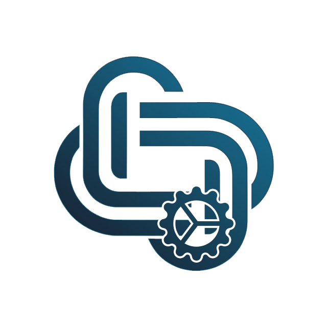

<p align="center"></p>

# coreAPI


## Description
The `coreAPI` package is a library that provides a set of tools to help you build a RESTful API with PHP.

## License
This software is distributed under the [MIT](LICENSE) license.

## Requirements
* PHP >= 8.0

## Security
Please disclose any vulnerabilities found responsibly – report security issues to the maintainers privately. See [SECURITY.md](SECURITY.md) for more information.

## Installation
Using Composer:
```sh
composer require laswitchtech/core-api
```

## How do I use it?
Review the [Documentation](docs/).
